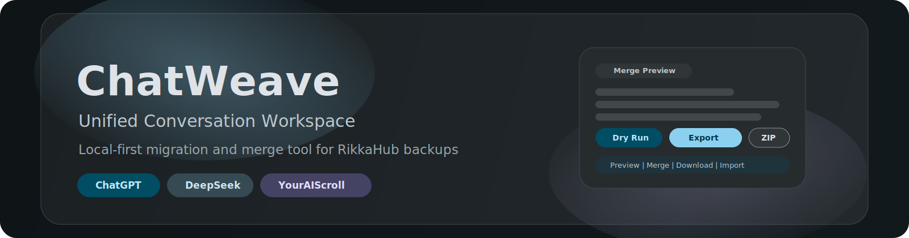
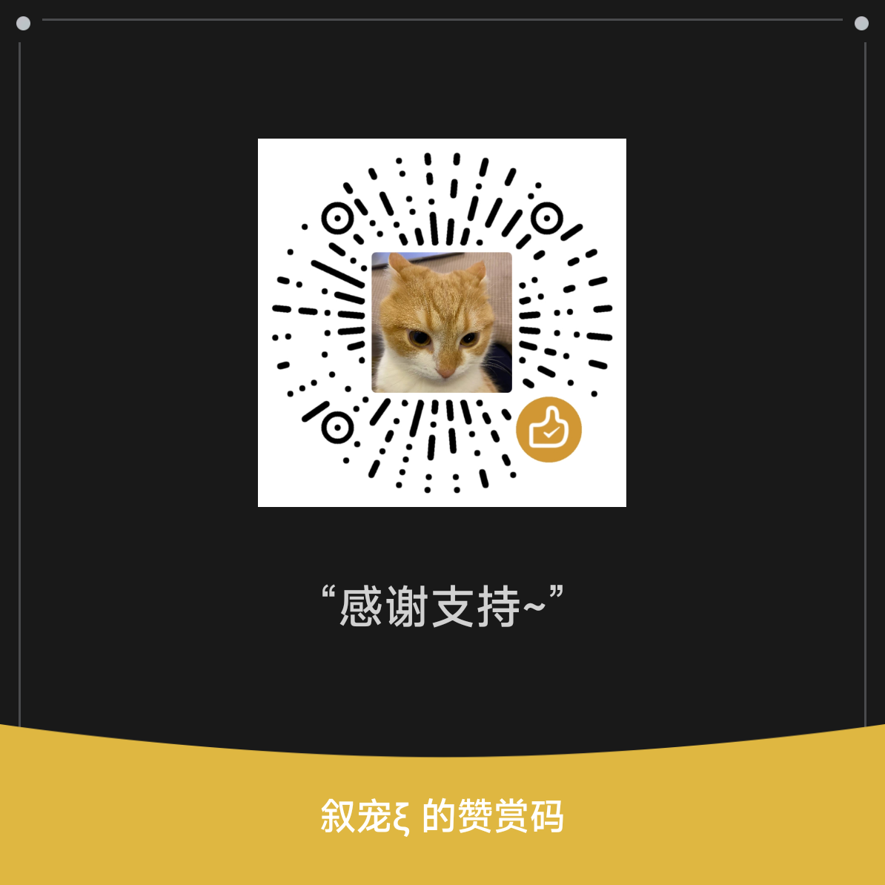

  

# ChatWeave · 统一会话工作台

本项目是一个 `local-first` 的浏览器工具，用于把多来源聊天记录整理、预检并合并为可导入 RikkaHub 的备份包。  
ChatWeave is a local-first browser tool for preparing and merging multi-source chat exports into RikkaHub-compatible backup packages.

## 简介 | Overview

- 纯前端运行，默认不依赖后端服务。  
  Runs in the browser without requiring a backend by default.
- 以会话工作台为核心，支持导入、筛选、编辑、合并。  
  Provides a workspace flow: import, review, edit, and merge.

## 主要功能 | Key Features

- 支持多来源导入（ChatGPT / DeepSeek / YourAIScroll）  
  Multi-source import support (ChatGPT / DeepSeek / YourAIScroll)
- 合并前预检和差异提示  
  Pre-merge dry run and diff warnings
- 冲突处理策略与助手合并策略  
  Duplicate strategy and assistant merge strategy
- 输出可导入 RikkaHub 的备份 ZIP  
  Exports a RikkaHub-importable backup ZIP

## 快速开始 | Quick Start

1. 使用现代浏览器打开 `index.html`  
   Open `index.html` in a modern browser.
2. 导入源数据并选择会话  
   Import source data and choose conversations.
3. 按需设置合并策略并执行合并  
   Configure merge options and run merge.
4. 下载结果 ZIP 并导入 RikkaHub  
   Download output ZIP and import into RikkaHub.

## 隐私说明 | Privacy

本仓库仅开源代码，不包含个人聊天导出、数据库、备份 ZIP、日志等敏感内容。  
This repository contains code only and excludes personal exports, databases, backup ZIPs, and logs.

## 赞赏 | Appreciation

如果这个项目对你有帮助，欢迎支持：

  

